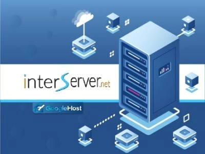

# Top Cloud VPS Hosting Providers: Lightning-Fast Deployment & Worldwide Coverage

Looking for reliable cloud infrastructure that won't break the bank? You're about to discover providers offering dedicated resources, instant scalability, and global data centers—perfect for handling traffic spikes, running resource-intensive apps, or simply ensuring your site stays blazing fast 24/7.

---

## What Is Cloud VPS Hosting?

Cloud VPS hosting uses virtualization and cloud computing to give you dedicated server resources—CPU, RAM, storage, and bandwidth—spread across multiple physical servers. This means your site stays accessible even if one server goes down, and you can scale resources instantly as your traffic grows.

Unlike traditional hosting where you share a single server with hundreds of sites, cloud VPS provides isolated environments with guaranteed resources. Your data lives on multiple servers worldwide, ensuring zero downtime and lightning-fast access from anywhere.

Think of it as having your own private slice of the cloud—powerful enough to handle serious traffic, flexible enough to grow with you, and surprisingly affordable when you consider what you're getting.

## Top 9 Cloud VPS Providers for 2025

### 1. ScalaHosting – Premium Security Meets Affordability

ScalaHosting stands out with its proprietary SShield security system and sPanel control panel—think cPanel functionality without the cPanel price tag. Your data gets distributed across global servers with built-in anti-DDoS protection, malware scanning, and 24/7 server monitoring catching issues before they become problems.

What makes ScalaHosting compelling is the combination of enterprise-grade security with managed services. SShield actively blocks threats in real-time, while sPanel gives you full control without the learning curve of traditional panels.

**Key Features:**
- Advanced DDoS protection and real-time malware scanning with SShield technology
- Exclusive sPanel control panel for streamlined site management
- Unlimited bandwidth, free SSL certificates, and complimentary site migration

**Pricing:** Managed Cloud VPS plans start at $29.95/month with TurboFast servers and comprehensive support. Currently offering up to 36% off with additional 10% discount using code GOOGIEHOST.

**Pros:**
- Industry-leading security features included by default
- User-friendly sPanel alternative to expensive control panels
- Excellent 24/7 technical support

**Cons:**
- Slightly higher entry price than budget competitors
- Limited to specific data center locations

### 2. Kamatera – Global Network with Instant Scaling

With 21 data centers spanning four continents and two decades of experience, Kamatera delivers enterprise-level infrastructure with pay-as-you-go flexibility. Their platform excels at instant resource scaling—need more RAM for a traffic spike? Done in minutes.

Kamatera's standout feature is customization. Instead of preset tiers, you configure exactly what you need: CPU cores, RAM, storage type, and bandwidth. This prevents paying for resources you won't use while ensuring you have power when needed.

**Key Features:**
- Instant scalability—adjust resources on-demand without downtime
- Automated backups and comprehensive 24/7 monitoring
- Server deployment completes in under 60 seconds

**Pricing:** Fully customizable—build your configuration and pay only for what you use. 30-day free trial available (no credit card required).

**Pros:**
- Complete flexibility in resource allocation
- Extensive global data center network
- Root access for full server control

**Cons:**
- Pricing complexity for newcomers
- Managed services cost extra

Ready to experience truly scalable cloud infrastructure? Modern businesses need hosting that adapts as quickly as their traffic does. **With Kamatera, you're getting enterprise-grade servers that scale instantly—without the enterprise price tag.** Whether you're deploying applications globally or need rock-solid uptime for mission-critical sites, [Kamatera's 21 worldwide data centers and flexible resource allocation](https://www.vultr.com/?ref=9738262-9J) make it dead simple to launch VPS instances anywhere, anytime. Plus, their 30-day free trial means you can test-drive the infrastructure risk-free before committing.

### 3. Hostinger – Best Budget-Friendly Option

Hostinger proves cloud VPS doesn't require enterprise budgets. Starting at $8.99/month, you get 2 CPU cores, 3GB RAM, and 200GB NVMe SSD storage—enough to host 300 websites with room to grow.

The value proposition here is straightforward: modern NVMe storage for speed, unlimited bandwidth so traffic spikes won't cost extra, and free SSL certificates for every domain. Their WordPress Staging tool lets you test changes safely before going live—a feature usually reserved for premium plans.

**Key Features:**
- Ultra-fast NVMe SSD storage for optimal loading speeds
- WordPress Staging environment for safe testing
- Unlimited bandwidth and free SSL certificates included

**Pricing:** Three tiers available—Cloud Startup ($8.99/month), Cloud Professional ($14.99/month), Cloud Enterprise ($29.99/month). Currently 65% off with code SAVEBIG.

**Pros:**
- Exceptional value for performance delivered
- Beginner-friendly hPanel control interface
- 30-day money-back guarantee

**Cons:**
- Support can be slower during peak times
- Advanced features require higher-tier plans

### 4. LiquidWeb – Enterprise Performance, Developer-Friendly

LiquidWeb's Cloud Studio brings together Cloud Metal and Cloud VPS under one umbrella, delivering performance-to-price ratios that make sense for growing businesses. With 100% uptime guarantee and plans starting at just $5/month, you're getting serious infrastructure without the typical enterprise sticker shock.

Choose between fully managed VPS (they handle server maintenance) or unmanaged (you get root access and full control). Cloud Studio supports InterWorx, Plesk, and cPanel, so you're not locked into proprietary systems.

**Key Features:**
- Both managed and unmanaged VPS options available
- Multiple control panel choices (InterWorx, Plesk, cPanel)
- Standard DDoS protection free, advanced protection $99/month

**Pricing:** Three specialized tiers—General Compute (from $5/month), Memory Optimized (from $15/month), CPU Optimized (from $20/month). Currently 50% off first 3 months.

**Pros:**
- Flexible management levels suit all skill levels
- 100% uptime guarantee backed by SLA
- Highly scalable resource allocation

**Cons:**
- Advanced DDoS protection costs extra
- Interface learning curve for beginners

### 5. DigitalOcean – Developer's First Choice

DigitalOcean built their reputation on simplicity for developers. Droplets (their VPS instances) deploy in seconds, Kubernetes integration is seamless, and the isolated core network ensures your apps run consistently fast.

Developers appreciate the full root access, API-first architecture, and extensive documentation. Whether you're deploying containerized apps or running traditional web stacks, DigitalOcean's infrastructure handles it smoothly.

**Key Features:**
- Full root access for complete server control
- Hourly billing option—pay only for what you use
- Private IP addresses with maximum isolation

**Pricing:** Flexible configurations from basic Droplets to specialized plans. New users get $200 free credit to explore the platform.

**Pros:**
- Developer-friendly tools and documentation
- Kubernetes integration for container orchestration
- Predictable pricing with no surprises

**Cons:**
- Less hand-holding for non-technical users
- Managed services require additional setup

### 6. Cloudways – Managed Cloud Made Simple

Cloudways doesn't own servers—they manage cloud infrastructure from Google Cloud, AWS, and DigitalOcean for you. This means you get the power of major cloud providers without the complexity of managing them directly.

Their platform includes free SSL certificates, automated backups on demand, and scalable storage that grows with your needs. The real win? You focus on your business while Cloudways handles server optimization, security patches, and performance tuning.

**Key Features:**
- Free SSL certificates with automatic renewal
- Block storage that scales independently
- Regular automated backups plus on-demand snapshots

**Pricing:** Varies by underlying cloud provider chosen. Three-day free trial available (no credit card required).

**Pros:**
- Access to multiple premium cloud providers
- Fully managed—no server maintenance required
- Excellent caching and optimization tools

**Cons:**
- Pricing higher than self-managed alternatives
- Limited customization compared to direct provider access

### 7. InterServer – Transparent Pricing Promise

Founded in 1999, InterServer made their name on one principle: no surprise renewal prices. The rate you sign up at stays locked in—no price jumps when your term ends.

They never oversell servers, which means your site maintains consistent speed even during peak hours. The included SitePad website builder handles everything from landing pages to full e-commerce sites without coding knowledge.

**Key Features:**
- Price lock guarantee—renewal rate matches signup rate
- Ultra-fast speeds from never overselling servers
- SitePad drag-and-drop website builder included

**Pricing:** Five VPS types available—Windows VPS, Home VPS, WordPress VPS, Webuzo VPS, and Storage VPS. Currently $1 for first 3 months with code GRABPENNY.

**Pros:**
- Honest, transparent pricing structure
- Strong performance from underutilized servers
- Beginner-friendly tools included

**Cons:**
- Fewer data center locations than competitors
- May not scale for very large projects

### 8. FastComet – Global Reach, Local Speed

FastComet's 11 worldwide data centers ensure fast loading times regardless of visitor location. Since 2013, they've built a reputation on combining speed with ease of use—their SiteBuilder lets anyone create professional sites through drag-and-drop simplicity.

Free managed migrations mean switching to FastComet is painless. Their team handles the technical details while you keep your site running without interruption.

**Key Features:**
- Drag-and-drop SiteBuilder for easy website creation
- cPanel control panel for familiar management interface
- Free managed migrations with full technical support

**Pricing:** Four cloud VPS tiers with varying resource allocations. Includes Softaculous, free site setup, and SSH access. Currently up to 30% off limited-time offer.

**Pros:**
- Extensive global data center network
- Complimentary domain transfers included
- NVMe storage for maximum speed

**Cons:**
- Full feature access requires higher-tier plans
- Premium support costs extra

### 9. Vultr – Modern Infrastructure, Old-School Value

Despite launching in 2014, Vultr quickly established themselves through aggressive expansion—they now operate data centers globally, providing low-latency access worldwide.

Their one-click app installations cover everything from WordPress to complex development stacks. The custom control panel simplifies deployment without sacrificing power, while built-in DDoS protection keeps your infrastructure secure.

**Key Features:**
- One-click installations for 20+ popular applications
- Custom control panel optimized for quick deployment
- DDoS protection included with all plans

**Pricing:** Plans from $6/month to $3,840/month depending on server type (performance, storage-optimized, memory-optimized, or CPU-optimized). Deploy high-performance SSD VPS globally in 60 seconds.

**Pros:**
- Extensive application marketplace
- Powerful yet intuitive control panel
- Pay-as-you-go flexibility

**Cons:**
- Pricing varies significantly by configuration
- Documentation could be more comprehensive

---

## Why Choose Cloud VPS Hosting?

Cloud VPS hosting delivers advantages that traditional hosting simply can't match:

**Reliability:** Your data lives on multiple servers. If one fails, others instantly take over—guaranteeing 99.99% uptime without you lifting a finger.

**Raw Performance:** Modern Intel processors, NVMe SSD storage, and dedicated RAM mean your sites load in milliseconds, not seconds. First impressions matter, and slow sites lose visitors.

**True Privacy:** Dedicated private IPs mean this is *your* server environment. No shared resources, no noisy neighbors affecting your performance, no security risks from others' mistakes.

**Effortless Scaling:** Traffic exploded overnight? Scale resources instantly without downtime or migrations. Pay only for what you use, when you use it.

**Enterprise Security:** Anti-DDoS protection, BitNinja security, Imunify360, and continuous server monitoring defend against threats automatically. Your data stays protected while you focus on business.

## Choosing Your Cloud VPS Provider

When evaluating providers, consider these critical factors:

**Budget Reality:** Cloud VPS costs more than shared hosting, but the performance and reliability justify it. Compare total costs including renewals—some providers spike prices after year one.

**Backup Strategy:** Daily automated backups are non-negotiable. When disaster strikes, you need recent snapshots to restore from quickly.

**Security Stack:** Look for included DDoS protection, firewalls, malware scanning, and SSL certificates. Security shouldn't be an expensive add-on.

**Resource Flexibility:** Unlimited bandwidth and scalable storage prevent surprise overage charges when traffic grows.

---

## Frequently Asked Questions

**Are virtual private servers secure?**

Yes, significantly more secure than shared hosting. Cloud VPS includes dedicated firewalls, isolated environments, and protection against common threats like DDoS attacks and malware injections.

**Which provider offers the best value?**

InterServer and Kamatera balance quality and affordability effectively. InterServer's price-lock guarantee prevents surprise renewals, while Kamatera's customization ensures you're not paying for unused resources.

**Do I need technical expertise for VPS hosting?**

Depends on your choice. Managed VPS services (like ScalaHosting or Cloudways) handle technical maintenance for you. Unmanaged VPS requires server administration knowledge—perfect for developers, challenging for beginners.

**Does Kamatera provide root access?**

Yes, Kamatera includes full root access across their VPS services, giving you complete flexibility to configure resources and customize your environment exactly how you need it.

---

## Final Thoughts

Choosing the right cloud VPS provider determines whether your online presence thrives or struggles. Each provider on this list brings unique strengths—ScalaHosting's security focus, Kamatera's flexibility, Hostinger's value, or Vultr's modern infrastructure.

The smart move? Take advantage of free trials and money-back guarantees. Test performance with your actual workload before committing long-term. Your business deserves infrastructure that grows with it, stays secure, and performs reliably when it matters most.
